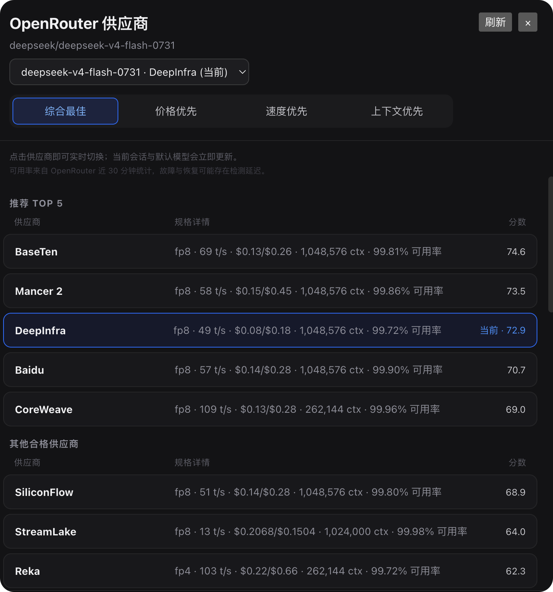
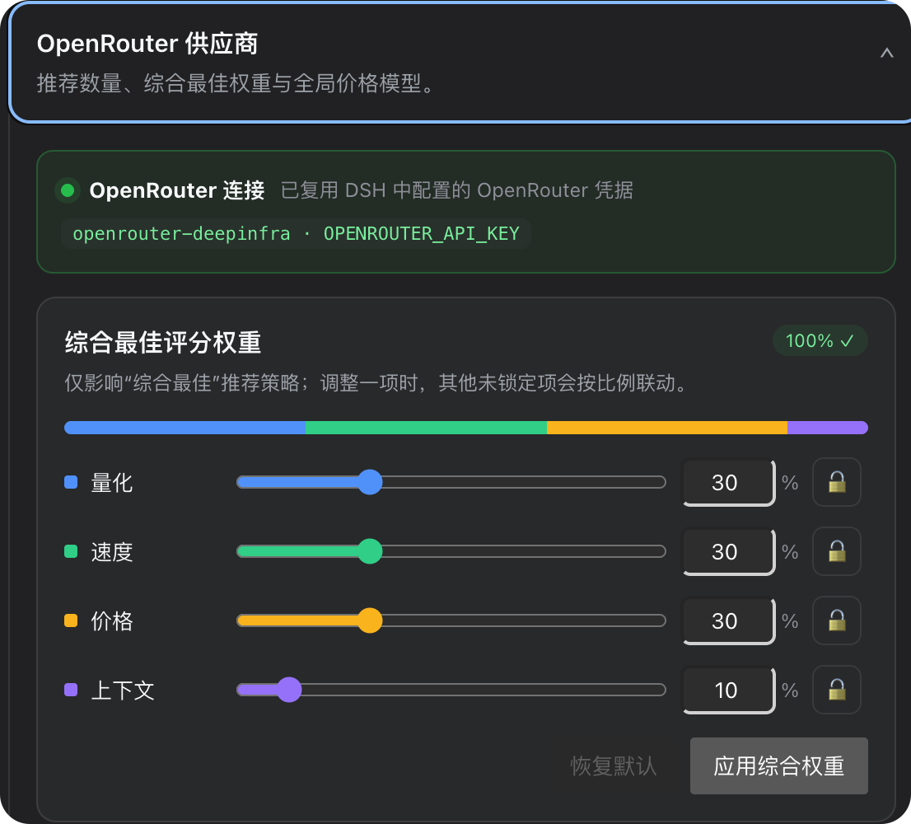

# dsh-openrouter-provider-advisor

同一个模型，不同 OpenRouter 供应商的价格、缓存费用、速度和稳定性可能相差很大。这个插件帮助 DeepSeek Harness 用户自动找到**更省钱、更合适的供应商**，并一键切换当前会话。

插件综合量化、速度、缓存重度价格、上下文与可用率，为当前模型给出 Top 5 供应商。你不需要逐个查价格、建 preset：点击一行即可同步切换当前会话与默认模型。

> **核心价值：在不更换模型的前提下，减少不必要的调用成本，并在价格、速度和可靠性之间找到更适合当前工作负载的线路。**

插件推荐有机会找到比模型官网 API 明显更便宜的同模型线路。以 2026-08-25 面板中的 StreamLake `deepseek-v4-flash-0731` 报价为例，按 `1 USD ≈ 6.7225 CNY` 换算，与当时 DeepSeek 官网高峰期 Flash 报价对比如下：

| 每百万 tokens | StreamLake | DeepSeek 官网高峰期 | 预计降低 |
| --- | ---: | ---: | ---: |
| 输入（缓存命中） | $0.0028 ≈ ¥0.0188 | ¥0.10 | **81.2%** |
| 输入（缓存未命中） | $0.088 ≈ ¥0.5916 | ¥3.00 | **80.3%** |
| 输出 | $0.064 ≈ ¥0.4302 | ¥9.00 | **95.2%** |
| Code Agent 加权估算（2% / 8% / 90%） | ≈ ¥0.0632 | ≈ ¥0.8700 | **92.7%** |

> 以上仅是特定时间点的价格示例，不构成持续低价承诺；OpenRouter 供应商报价、DeepSeek 官网定价和汇率都会变化，请以插件实时结果与 [DeepSeek 官方价格页](https://api-docs.deepseek.com/zh-cn/quick_start/pricing/) 为准。汇率参考：[USD/CNY 2026-08-25](https://www.investing.com/currencies/usd-cny-historical-data)。

🌏 **中文** · [English](./README_EN.md)



## 功能

- **帮助省钱**：比较同一模型在不同供应商的输入、输出和缓存读取价格，避免只看单一标价。
- **找到更合适的供应商**：价格不是唯一标准；速度、量化、上下文和可靠性一起参与排序。
- **当前模型推荐**：自动对齐 DSH 模型与 OpenRouter `author/slug`，不推荐无关模型。
- **四种策略**：综合最佳、价格优先、速度优先、上下文优先。
- **Code Agent 价格模型**：默认按输入 2%、输出 8%、缓存读取 90% 计算价格得分。
- **可靠性保护**：过滤不可用 endpoint，并按 OpenRouter 近 30 分钟 uptime 温和降权。
- **点击实时切换**：创建或更新 OpenRouter preset，切换当前会话并保存默认模型。
- **完整 DSH 模型目录**：复用 DSH 已有配置，不写死模型列表。
- **联动权重 UI**：滑块、百分比输入和锁定按钮协同调整，总和始终为 100%。
- **复用 DSH 凭据**：读取 OpenRouter provider 的 `apiKeyEnv`，API Key 不进入浏览器。
- **Agent 工具**：只读推荐免审批；Agent 发起切换时必须经过 DSH 原生审批。
- **中英文界面**：跟随 DSH 当前语言实时切换。

## 界面

| 供应商推荐与切换 | 权重与凭据状态 |
| --- | --- |
| 同一模型的供应商价格与性能放在一张表里，快速找到更省钱且适合当前任务的线路；点击一行立即切换。 | 联动滑块配置综合权重与缓存重度价格模型；顶部只展示 credential reference，不展示密钥。 |
|  |  |

> 可用率来自 OpenRouter 近 30 分钟统计。刚发生的故障、限流和恢复可能存在检测延迟；它不是主动健康探测。

## 安装

前置条件：DSH `0.1.1-rc.2` 或更新版本、Node.js `^22.19.0` 或 `>=24`，并已在 **DSH 设置 → 模型** 中配置 OpenRouter provider/API Key。

```bash
dsh plugin --profile web add dsh-openrouter-provider-advisor@latest
```

安装后硬刷新浏览器：macOS 使用 `Cmd + Shift + R`，Windows/Linux 使用 `Ctrl + Shift + R`。若 Host 部分已在运行，重启一次 `dsh web`。

更新与卸载：

```bash
dsh plugin --profile web add dsh-openrouter-provider-advisor@latest
dsh plugin --profile web remove dsh-openrouter-provider-advisor
```

## 使用

1. 在 DSH 中打开普通会话。
2. 点击左侧栏底部的 **OpenRouter 供应商**。
3. 选择要分析的 DSH 模型和推荐策略。
4. 查看分数与可用率，点击供应商完成切换。
5. 下一次请求将使用新的 `@preset/<model>-<provider>`。

切换按顺序执行：

```text
创建/更新 OpenRouter preset
        ↓
写入 DSH OpenRouter 模型条目
        ↓
session.selectModel 切换当前会话
        ↓
保存为 DSH 默认模型
```

已经组装完成的请求不会被中途改写；切换从下一次请求开始生效。

## 推荐策略

综合最佳默认使用：量化 30%、速度 30%、价格 30%、上下文 10%。设置页中的“综合最佳评分权重”只影响综合最佳；价格、速度和上下文策略使用内置权重。

如果目标是优先降低费用，可以直接选择“价格优先”；如果希望控制成本但不牺牲太多速度和稳定性，使用默认“综合最佳”。推荐结果是决策辅助，不保证每次请求都落在绝对最低价线路。

默认价格模型针对 Code Agent 的高缓存流量：

```text
价格成本 = 输入价 × 2% + 输出价 × 8% + 缓存读取价 × 90%
```

### 可用率降权

`status != 0` 的 endpoint 直接排除。其余 endpoint 使用连续、温和的通用降权，避免短时小幅波动造成排名断崖：

| OpenRouter 近 30 分钟 uptime | 保留分数 |
| --- | ---: |
| ≥99.5% | 100% |
| 99–99.5% | 97%–100%（连续插值） |
| 98–99% | 90%–97%（连续插值） |
| 95–98% | 75%–90%（连续插值） |
| 90–95% | 50%–75%（连续插值） |
| <90% | 10%–50%（连续插值） |
| 无数据 | 85% |

用户设置中的阈值和系数会在阈值以下 5 个百分点内渐进生效，并与通用降权取更严格者。

## Agent 工具

- `recommend_openrouter_providers`：读取当前模型的推荐列表。
- `switch_openrouter_provider`：切换供应商；属于写操作，始终请求 DSH 用户审批。

人类在面板里点击供应商时视为明确操作，会直接执行切换。

## 凭据与安全

- 优先复用当前 DSH OpenRouter provider 的 `apiKeyEnv`，兼容回退 `OPENROUTER_API_KEY` reference。
- API Key 只在 Host 端解析，不进入 Client bundle、HTTP 响应或插件设置。
- Host 写接口只接受同源 JSON，请求体上限 64KB。
- OpenRouter 查询超时 15 秒，preset 写入超时 30 秒。
- Controller 不持久保存密钥；执行写操作前重新解析凭据。
- 插件不读取或传输会话正文、历史消息和用户文件。

## 数据来源与限制

插件只调用 OpenRouter 官方 API：

```text
GET  /api/v1/models
GET  /api/v1/models/{author}/{slug}/endpoints
POST /api/v1/presets/{slug}/chat/completions
```

不抓取产品页 HTML。OpenRouter 统计可能滞后于即时 `429`、超时和恢复；点击供应商会创建或更新真实 preset；切换上游可能使 KV cache 失效。

## 常见问题

| 现象 | 处理方式 |
| --- | --- |
| 找不到 `web` profile | 先运行一次 `dsh web`，再安装插件。 |
| 插件已安装但界面没变化 | 硬刷新浏览器；Host 有改动时重启 DSH。 |
| 未检测到 OpenRouter 凭据 | 在 DSH 设置 → 模型中配置 OpenRouter provider/API Key。 |
| 某供应商分数高但请求 429 | uptime 有统计延迟，临时切换到其他供应商。 |
| `minimum release age` | 等待 profile 安全策略允许该版本后重试。 |
| DSH 拒绝 `.env` 中的 `DEEPSEEK_BASE_URL` | 从项目 `.env` 移除，并在启动 DSH 的终端中 `export`。 |

## 本地源码开发

```bash
git clone https://github.com/xuanfengtechx/dsh-openrouter-provider-advisor.git
cd dsh-openrouter-provider-advisor
npm install
npm run verify
dsh plugin --profile web add -w "$PWD"
```

发布预演：

```bash
npm pack --dry-run
npm publish --dry-run --access public
```

自动测试不会点击真实供应商，因为切换会在用户 OpenRouter 账号中创建或更新 preset。

## License

[MIT](./LICENSE)
